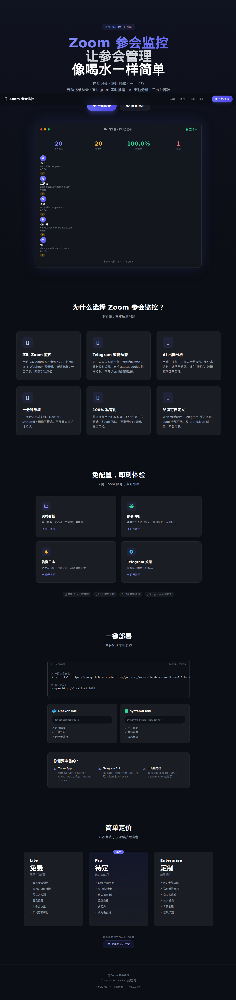

# Zoom Attendance Monitor

> 让参会管理像喝水一样简单
>
> 自动记录参会 · Telegram 实时预警 · AI 出勤分析 · 三分钟部署

<sup>**v1.0.0-lite** — [更新日志](CHANGELOG.md) · [安装文档](docs/INSTALL.md) · [安全审计](RELEASE_AUDIT.md)</sup>

<p align="center">
  <a href="#">
    
  </a>
</p>

<p align="center">
  <a href="http://localhost:8000/demo"><b>📺 在线演示</b></a> ·
  <a href="#部署方式"><b>🚀 快速部署</b></a> ·
  <a href="docs/INSTALL.md"><b>📖 安装文档</b></a> ·
  <a href="CHANGELOG.md"><b>📋 更新日志</b></a>
</p>

<p align="center">
  
  
  
</p>

---

**功能亮点:**
- 📹 **实时 Zoom 监控** — 自动拉取参会列表，轮询 + Webhook 双通道
- 🤖 **Telegram 智能推送** — 陌生人检测、签到提醒、迟到标记
- 📊 **看板与分析** — 实时数据看板 + AI 自动生成每日/每周出勤报告
- 🔒 **100% 私有化** — 数据存自己的服务器，不经过第三方云端
- 🚀 **三分钟部署** — Docker / systemd 双模式，一行命令搞定

---

## 目录结构

```
/opt/zoom-monitor/
├── app.py           # FastAPI 入口（api / webhook / monitor / command）
├── monitor.py       # 轮询服务（拉 Zoom API 参会列表）
├── config.py        # 配置加载（.env）
├── db.py            # SQLite 数据库操作
├── alerts.py        # Telegram 推送
├── templates.py     # Telegram 推送模板引擎（从 brand.json 读取）
├── zoom_api.py      # Zoom API 客户端
├── command_bot.py   # Telegram 指令 Bot（/status /enable /disable 等）
├── brand.json       # 品牌配置（名称 / 配色 / Telegram 模板）
├── brand.yml        # brand.json 的 YAML 版
├── tracking.db      # SQLite 数据库（自动创建）
├── .env             # 密钥和配置（chmod 600）
├── Dockerfile       # Docker 构建
├── docker-compose.yml
├── requirements.txt
├── requirements.prod.txt
├── .dockerignore
├── docker/
│   └── entrypoint.sh
├── templates/       # Jinja2 模板（品牌化 UI）
│   ├── base.html
│   ├── dashboard.html
│   ├── events.html
│   ├── participants.html
│   └── alerts.html
└── static/          # 静态资源
    └── style.css
```

## 部署方式

### 方案 A：systemd 生产（推荐）

```bash
# 1. 安装依赖
cd /opt/zoom-monitor
pip install -r requirements.txt

# 2. 配置 .env
cp .env.example .env
chmod 600 .env
# 编辑 .env 填入 Zoom 凭据和 Telegram Token

# 3. 启动 4 个 systemd 服务
sudo systemctl daemon-reload
sudo systemctl enable --now zoom-api zoom-webhook zoom-monitor zoom-command

# 查看状态
sudo systemctl status zoom-api zoom-webhook zoom-monitor zoom-command
sudo journalctl -u zoom-monitor -f
```

#### systemd 单元文件

`/etc/systemd/system/zoom-api.service`:
```
[Unit]
Description=Zoom Monitor API
After=network.target

[Service]
Type=simple
User=root
WorkingDirectory=/opt/zoom-monitor
ExecStart=/opt/1panel/runtime/python/hermes-agent/repo/hermes-venv/bin/python3 /opt/zoom-monitor/app.py api
EnvironmentFile=/opt/zoom-monitor/.env
Restart=always
RestartSec=5

[Install]
WantedBy=multi-user.target
```

`/etc/systemd/system/zoom-webhook.service`（同上，ExecStart 改为 `app.py webhook`）、
`zoom-monitor.service`（`app.py monitor`）、
`zoom-command.service`（`app.py command`）。

> **端口**: API 监听 8000，Webhook 监听 9000。建议通过 Cloudflare Tunnel 暴露 Webhook 端口。

### 方案 B：Docker 部署（环境隔离，适合需要独立环境的场景）

```bash
cd /opt/zoom-monitor
docker compose build
docker compose up -d
docker compose ps
```

> **注意**: Docker 和 systemd 两组服务**不冲突**，可以同时运行。Docker 端口为 8082/9443。

## 配置说明（.env）

```
ZOOM_ACCOUNT_ID=        # Zoom 账户 ID（Server-to-Server OAuth）
ZOOM_CLIENT_ID=         # Zoom App Client ID
ZOOM_CLIENT_SECRET=*** # Zoom App Client Secret
ZOOM_HOST_EMAIL=        # 主持人邮箱（用于过滤主持人）
ZOOM_PMI_ID=            # 自习室 PMI 编号
ZOOM_EXTRA_MEETING_IDS= # 额外会议 ID（逗号分隔）

TELEGRAM_BOT_TOKEN=*** # Telegram Bot Token（从 @BotFather 获取）
TELEGRAM_PRIVATE_CHAT_ID=   # 私聊推送目标 Chat ID
TELEGRAM_GROUP_CHAT_ID=     # 群聊推送目标 Chat ID（可选）
TELEGRAM_GROUP_ENABLED=false

ZOOM_WEBHOOK_SECRET=*** # Zoom Webhook Secret（用于签名验证）
PUSH_START_HOUR=7       # 推送启用开始时间（MYT）
PUSH_END_HOUR=23        # 推送启用结束时间（MYT）
SIGNIN_DEADLINE_HOUR=9  # 签到截止时间（MYT）
```

## 服务说明

| 服务 | 说明 | 端口 |
|------|------|------|
| API | FastAPI 看板 + REST API | 8000 (systemd) / 8082 (Docker) |
| Webhook | Zoom 事件回调接收 | 9000 (systemd) / 9443 (Docker) |
| Monitor | 轮询拉取参会数据 | 无端口（后台服务） |
| Command | Telegram 指令 Bot | 无端口（后台服务） |

## Telegram 指令

| 指令 | 说明 |
|------|------|
| `/start` | 初始化 Bot |
| `/status` | 查看系统状态 |
| `/enable` | 开启推送 |
| `/disable` | 关闭推送 |
| `/quiet` | 进入静默模式 |
| `/loud` | 退出静默模式 |
| `/today` | 查看今日参会记录 |

## Telegram 推送模板

所有推送消息文案通过 `brand.json` 的 `telegram_templates` 字段配置，无需修改代码即可自定义文案。

支持以下模板变量：
- `{name}` — 参会人姓名
- `{email}` — 参会人邮箱
- `{time}` — 时间
- `{date}` — 日期
- `{count}` — 数量
- `{room}` — 会议室标签
- `{duration}` — 持续时间
- `{total}` — 总人数
- `{header_emoji}` — 品牌 emoji
- `{app_name}` — 应用名

## 品牌自定义

编辑 `brand.json` 即可修改：
- 应用名称（中英文）
- 配色（暗色主题 8 色）
- 口号
- Telegram 推送文案
- 品牌 emoji

Web 看板自动读取 brand.json 并应用品牌配色和文案。

## 数据库

SQLite（`tracking.db`），无需额外数据库服务。

主要表：
- `zoom_events` — Webhook 原始事件
- `zoom_participants` — 参会记录
- `seen_emails` — 邮箱去重（陌生人检测）
- `alerts` — 告警日志
- `settings` — 持久化设置（推送开关等）

## 健康检查

```bash
# systemd
curl http://127.0.0.1:8000/health
curl http://127.0.0.1:9000/health

# Docker
curl http://127.0.0.1:8082/health
curl http://127.0.0.1:9443/health
```

## 日志查看

```bash
# systemd
journalctl -u zoom-monitor -f -n 50

# Docker
docker logs zoom-monitor -f --tail 50
```

## 快速部署（30 秒脚本）

```bash
# 一步部署（Ubuntu / Debian）
sudo mkdir -p /opt/zoom-monitor
cd /opt/zoom-monitor
# 解压发布包或 git clone 后执行：
cp .env.example .env && chmod 600 .env
pip install -r requirements.txt
# 编辑 .env 填入密钥
sudo systemctl daemon-reload
sudo systemctl enable --now zoom-{api,webhook,monitor,command}
scripts/check_health.sh
```

## Webhook 配置

1. 确保 Webhook 服务（端口 9000）可以通过公网访问
   - 推荐方式：Cloudflare Tunnel
   - 备选：Nginx 反代 + Let's Encrypt
2. Zoom Marketplace → 你的 App → Feature → Webhook
3. 添加 Event Subscriptions：
   - Endpoint URL: `https://your-domain.com/webhook`
   - Events: `Meeting Participant Joined`, `Meeting Participant Left`
   - （可选）添加 Verification Token 到 `ZOOM_WEBHOOK_SECRET`
4. 验证：
   ```bash
   curl -X POST https://your-domain.com/webhook \
     -H "Content-Type: application/json" \
     -d '{"event":"test.connection","payload":{}}'
   ```

## 常见错误

| 现象 | 原因 | 解决 |
|------|------|------|
| Monitor 无输出 | Telegram Token 无效 | `curl https://api.telegram.org/bot<TOKEN>/getMe` 检查 |
| "401 Unauthorized" | Zoom Token 过期 | 检查 Zoom Marketplace App 是否激活 + Scopes 是否完整 |
| Webhook 返回 403 | 签名验证失败 | 检查 `ZOOM_WEBHOOK_SECRET` 与 Zoom Marketplace 一致 |
| Docker 启动失败 | 端口冲突 | `ss -tlnp | grep 8082` 检查冲突进程 |
| 表中无数据 | 时区错误 | Monitor 默认 UTC，看板显示 UTC；检查 `PUSH_*_HOUR` 配置 |
| systemd 启动后退出 | .env 路径不对 | 检查 `EnvironmentFile=/opt/zoom-monitor/.env` |
| pip install 失败 | Python 版本 < 3.10 | `python3 --version` 检查 |
| "no such table" | DB 未初始化 | 重启应用：`systemctl restart zoom-api` 自动建表 |
