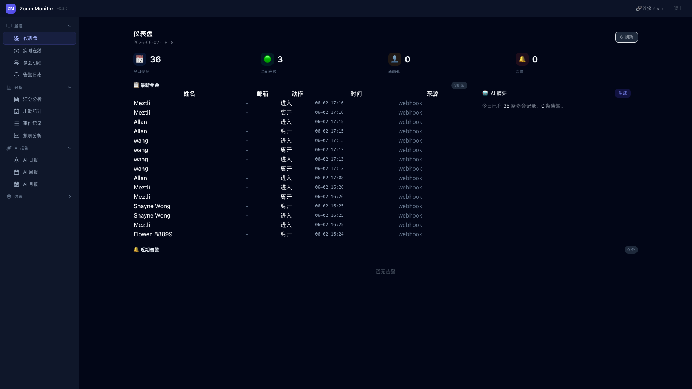
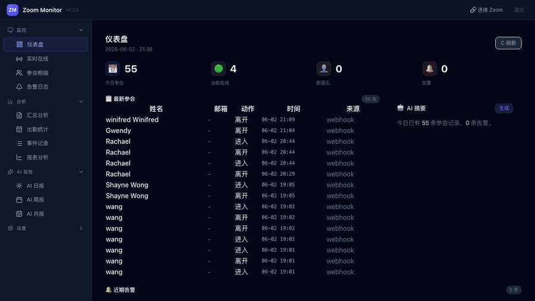
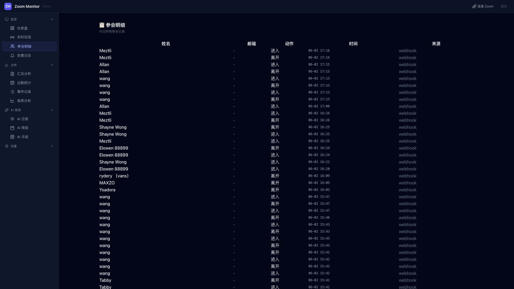
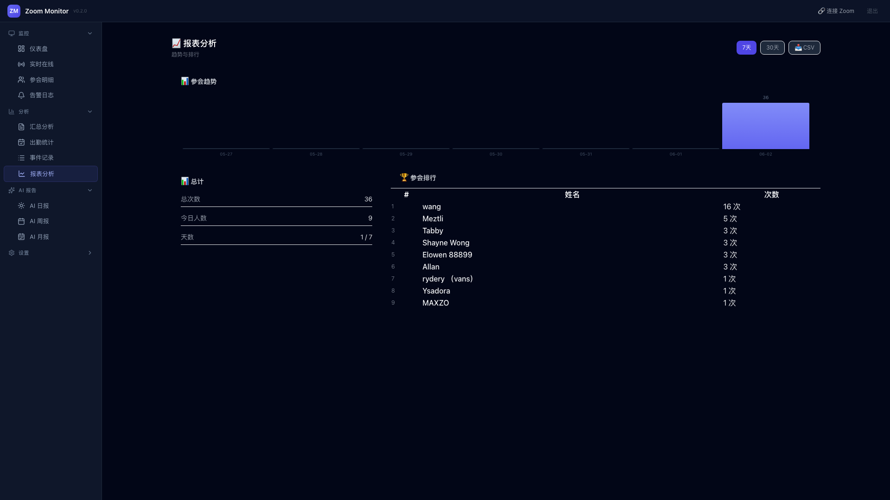
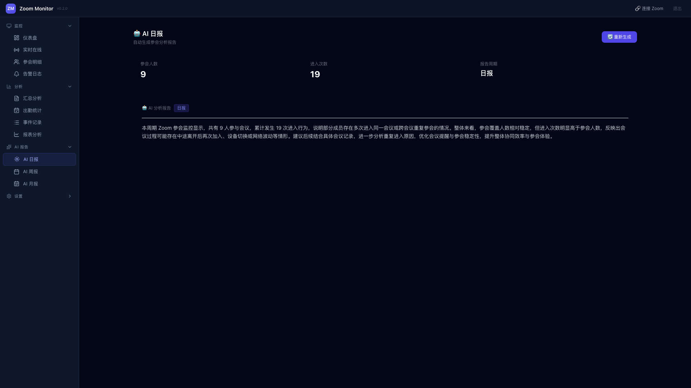
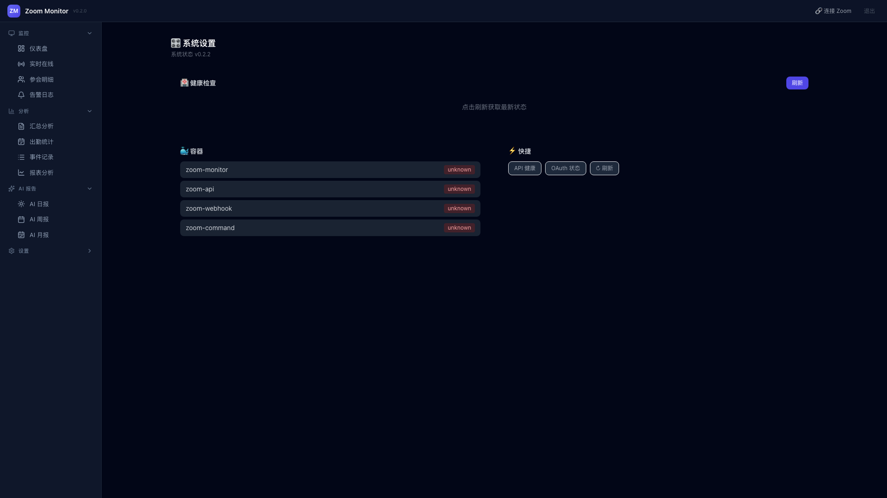
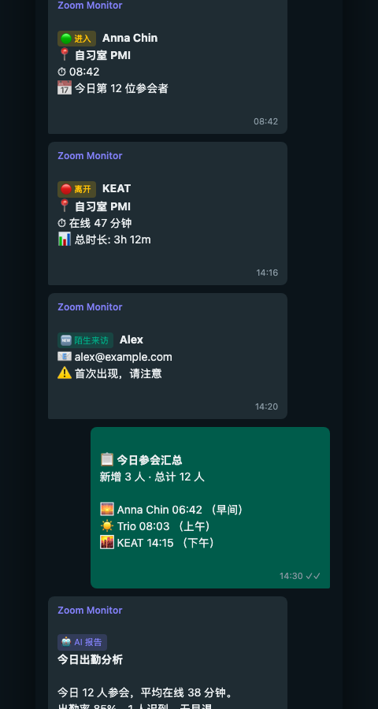

# Zoom Attendance Monitor

> AI-powered Zoom attendance tracking with Telegram alerts and automated reports.

  

## Demo

  

## Try Without Zoom

Try the full dashboard without any Zoom account or Telegram bot:

bash
DEMO_MODE=true docker compose up -d

Open http://localhost:8082/demo

Mock data auto-generated. No credentials needed.

## Quick Start

bash
git clone https://github.com/wang1682/zoom-attendance-monitor.git
cd zoom-attendance-monitor
cp .env.example .env
docker compose up -d

Open http://localhost:8082

## Features

- Dashboard - 1Panel-style UI with real-time cards, trends, rankings
- AI Reports - Daily, weekly, monthly AI-generated summaries
- Telegram Alerts - Instant push for join/leave, stranger detection
- Webhook - Real-time Zoom event capture via webhook + polling
- Health Check - One-click verify Zoom API, Webhook, Telegram, AI
- Docker - One-command deployment

## Screenshots

| Dashboard | Participants |
|---|---|
|  |  |
| Reports | AI Report |
|  |  |
| Settings | Telegram Push |
|  |  |

## Architecture

Zoom Meeting -> Webhook (9000) -> SQLite -> Dashboard (8082)
                    |-> Monitor (polling) ->|       |-> Telegram Bot

| Container | Role | Port |
|-----------|------|------|
| zoom-api | FastAPI Dashboard | 8082 |
| zoom-monitor | Zoom API polling | - |
| zoom-webhook | Zoom event receiver | 9000 |
| zoom-command | Telegram command handler | - |

## Security

- All ports bind to 127.0.0.1 by default
- .env file chmod 600
- Example config fully sanitized
- Cloudflare Tunnel recommended

## License

MIT License 2026
